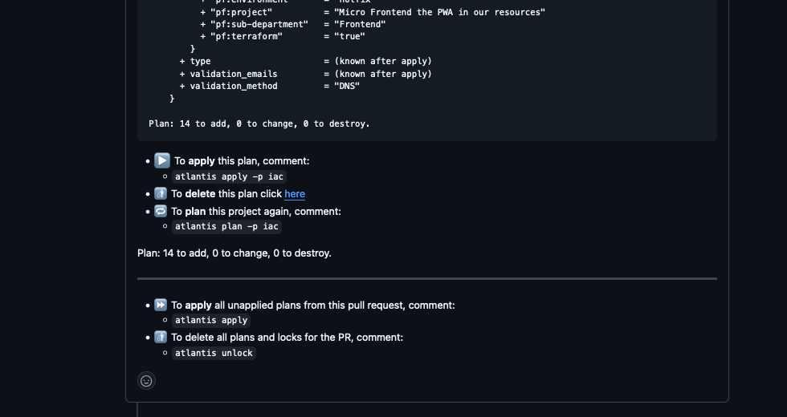

# Project based Infrastructure as Code

## You're doing it wrong.
Software development best practices applied to Infrastructure as *Code*

### Version: 0.1 
### Revision History
| Date | Version |	Description |	Author | Recording |
| ------  | ----- | ----- | ----- | ----- |
| 29-02-24 | 0.1 | HackGreenville presentation "You're doing IaC wrong. Project based IaC" | Brian Kennedy | https://www.youtube.com/watch?v=9I_yclPk_T8 |
| 29-10-24 | 0.2 | Presentation Part 2. "Tools and Quality" | Brian Kennedy |  |

 

 

 

 

 

 

 

 

 

 

 

 

 

### Introduction
I'm the guy that answers newbies questioning "What language/tech should I learn to become a developer" with "Math.  Computer Science is Math."  Grasshopper, first snatch this pebble from my hand, then you can learn.  At a previous place I was brought in to take a team doing ancient tech, dreamweaver or somesuch, and teach them modern software development practices and modern language, Ruby on Rails.  I didn't start with Okay lets start memorizing Rails conventions, I started with teaching Functional Programming so that when you need Rails to do some thing you just think of what's the right way to do it and, yup, that's the Rails convention for that thing.   So at ${current-place} when I was asked to build an Infrastructre as Code process, standard and libraries I started with software development best practices for writing *Code*,

 

 

 

 

 

 

 

 

 

 

 

 

 

### Software Development best practices
#### Documentation.
haha.
#### Keep code simple, DRY.
Modules.  Actually done right already.
#### Clear definition of requirements.
Modules.  Actually done right already.
#### Agile, Set small milestones.
#### Effective tools.
Atlantis, github.  Presentation 2
#### Code review and Quality Control
Environment gates.  github, Atlantis.   Presentation 2
#### Install and Deploy Automation
DON'T Copy Paste $#!~  Presentation 1
#### Appropriate Design and stick to it.
Microservice.   Presentation 1

 

 

 

 

 

 

 

 

 

 

 

 

 


### The wrong way
```
terraform % find . -not -path '*/\.*'
.
./prod
./prod/account.tf
./qa
./qa/account.tf
./qa/user_db.tf
./dev
./dev/account.tf
./dev/user_db.tf
./modules
./modules/sso
./modules/vpc
./modules/rds
```

 

 

 

 

 

 

 

 

 

 

 

 

 

### The right way

```
terraform % find . -not -path '*/\.*'
.
./iac-project
./iac-global-module
./iac-rds-module
./iac-account
```

 

 

 

 

 

 

 

 

 

 

 

 

 

### Remote States
```
data "terraform_remote_state" "state_file" {
 backend = "s3"

 config = {
   bucket   = "companycode-terraform-state-storage"
   key      = "${var.account_id}/us-east-1/account.tfstate"
   role_arn = "arn:aws:iam::${master-account}:role/atlantis"
   region   = "us-east-1"
 }
}

locals {
  vpc_arn                  = lookup(data.terraform_remote_state.state_file.outputs, "vpc_id", null)
  subnets              = lookup(data.terraform_remote_state.state_file.outputs, "private_subnets", null)
  eks_cluster_name                  = lookup(data.terraform_remote_state.state_file.outputs, "eks_cluster_name", null)
  eks_cluster_endpoint              = lookup(data.terraform_remote_state.state_file.outputs, "eks_cluster_endpoint", null)
  eks_cluster_certificate_authority = lookup(data.terraform_remote_state.state_file.outputs, "eks_cluster_certificate_authority", null)
}
```

```
account_id = "123456789012"
atlantis_role = "arn:aws:iam::${account_id}:role/atlantis"
env = "dev"
```

 

 

 

 

 

 

 

 

 

 

 

 

 

#### use it
```
module "account" {
  source        = "git@github.com:sirbeep/iac-global-module.git?ref=v1.0.0
  environment   = var.env
  account_id       = var.account_id
}
module "tags" {
  source          = "git@github.com:sirbeep/iac-module-tags.git?ref=v1.0.0"
  name            = "user-db-${var.env}"
  project         = "Make monay!!!"
  terraform       = true
  environment     = var.env
  cost_center     = "700"
  cost_department = "online"
  sub_department  = "Brian"
}
module "user-db" {
  source = "git@github.com:sirbeep/iac-module-aurora.git//serverless-cluster:ref=v1.0.0"
  cluster_name = "user-db-${var.env}"
  tags = module.tags.tags

  region = "us-east-1"
  env = var.env
  vpc_id = module.account.vpc_id
  subnet_id = module.account.subnets[var.subnet]
}
module "signup-queueue" { ..... }
module "microservice-serviceaccount" { ...... }
etc...
```

 

 

 

 

 

 

 

 

 

 

 

 

 

### Tools

#### Atlantis
Atlantis is a tool for automating IaC through the PR process, while keeping a clean separation of concerns.  Github does Git stuff, code, PRs, etc... and has no access to an environment to actually create/destroy resources.  Atlantis does.


Lets do an IaC PR.   Developer pushes code to the develop branch, does a PR to the dev environment:

 

 

 

 

 

 

 

 

 

 

 

 

 
Atlantis goes ahead and does a plan for what would change in that environment.  It also will replan when it detects a new commit push.

 

 

 

 

 

 

 

 

 

 

 

 

 
That plan has all of the details you'd expect from the terraform plan

 

 

 

 

 

 

 

 

 

 

 

 

 


 

 

 

 

 

 

 

 

 

 

 

 

 
Atlantis will not(with the settings I have) apply any changes until someone approves it.  (github settings will control who the someone has to be)

 

 

 

 

 

 

 

 

 

 

 

 

 
Once it's approved, you tell atlantis to apply the changes and it does.  Resources created and no one, including github, had access to the target environment to do it.  All cleanly automated and repeatable and SECURE.

 

 

 

 

 

 

 

 

 

 

 

 

 

We'll now glance at some of the many details you'll find in a more thourough inspection of my [Atlantis](https://github.com/sirbeep/atlantis-pr-pipeline "build repository")
 

 

 

 

 

 

 

 

 

 

 

 

 

### Questions?

1. Yes, the first question is "Okay then, how do you handle all of projects that need to be replanned and reapplied when you update a module or some other global setting if they're spread across many project repositories?"
